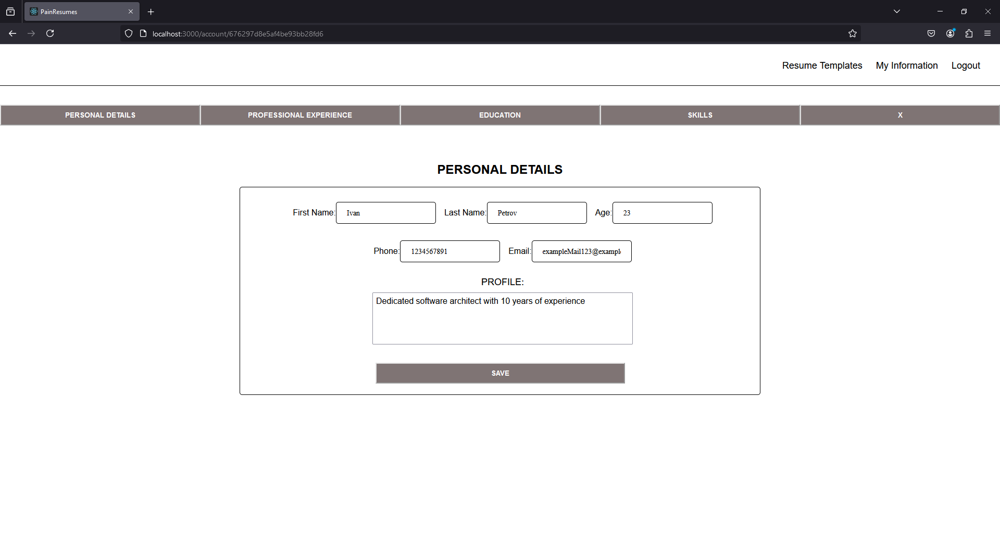
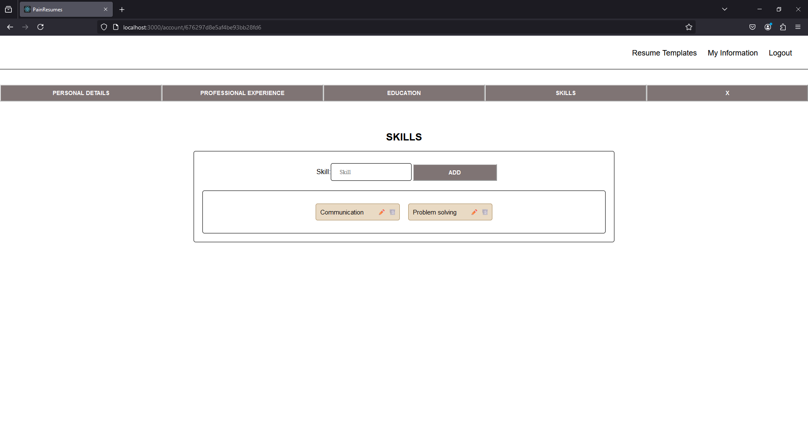
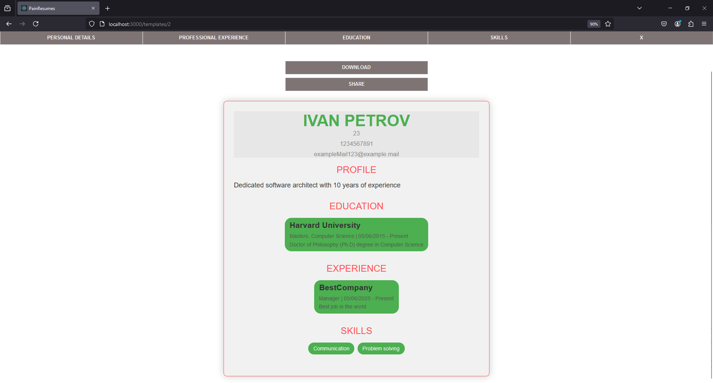
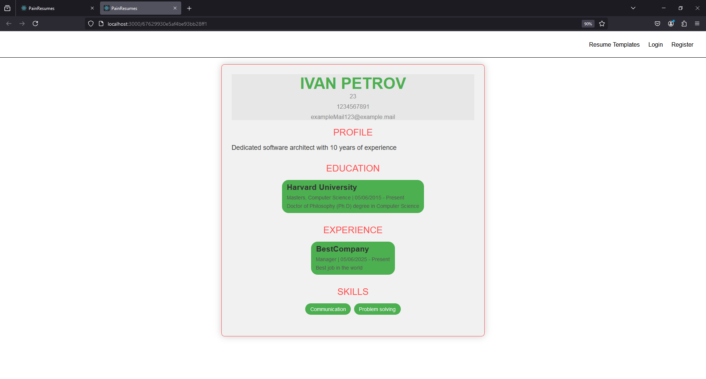
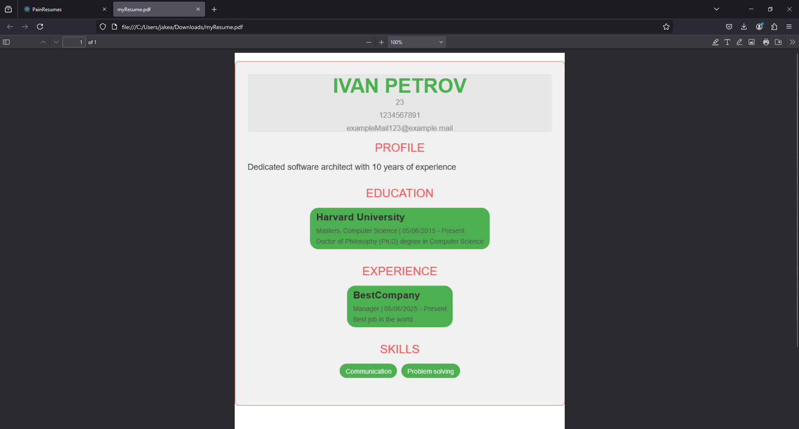

# PainResumes

## Overview

**PainResumes** is a cutting-edge web application designed to simplify the process of creating and managing professional resumes. With its intuitive interface, users can easily input their personal and professional details, which are seamlessly formatted into polished, professional resumes ready for download or sharing.

## Key Features

- **User Authentication:** Robust and secure user registration and login system to manage personal resume data.
- **Dynamic Resume Builder:** Interactive and customizable forms to input personal details, work experience, education, skills, and other relevant information.
- **Template Selection:** A diverse selection of professionally designed resume templates tailored for various industries.
- **Real-time Preview:** Live updates to preview your resume as you make edits.
- **Export Options:** Effortlessly download resumes in PDF format or share them via a unique link.

## Technologies Used

### Frontend:
- **HTML5**
- **CSS3**
- **JavaScript**
- **React.js**

### Backend:
- **Node.js**
- **Express.js**

### Database:
- **MongoDB**

### Version Control:
- **Git**

---

## Installation and Setup

### Prerequisites

Before setting up the application, ensure the following are installed on your system:

- [Node.js](https://nodejs.org/) (v14.x or higher)
- [MongoDB](https://www.mongodb.com/) (v4.x or higher)

### Installation Steps

1. **Clone the Repository:**

   ```bash
   git clone https://github.com/100QNKolev/PainResumes.git
   cd PainResumes
   ```

2. **Install Dependencies:**

   - Navigate to the **server** folder:
     ```bash
     cd server
     npm install
     ```

   - Navigate to the **application** folder:
     ```bash
     cd ../pain-resumes
     npm install
     ```

3. **Set Up Environment Variables:**

   - Update the MongoDB connection string in `./server/config/database.js` with your credentials.

4. **Start the Application:**

   - Start the server:
     ```bash
     cd server
     node index.js
     ```

   - Start the frontend application:
     ```bash
     cd ../pain-resumes
     npm start
     ```

---

## Usage

### Register an Account
Navigate to the registration page to create a new account. Alternatively, log in as a guest user!

### Build Your Resume
1. Log in to the application.
2. Use the interactive forms to enter your personal and professional details.
3. Select a template from the available designs.
4. Preview your resume in real-time while editing.

### Export or Share
- Download your resume in PDF format.
- Share your resume via a unique, shareable link.

---

## Features Walkthrough

### 1. Interactive Forms
Create your resume effortlessly using dynamic forms:
- Input personal details, skills, and work experience.
- Easily update or revise your information.




### 2. Real-time Preview
Preview your resume as you build it to ensure it meets your expectations.



### 3. Export and Share
- **Share:** Generate a unique link to share your resume with potential employers.
- **Download:** Export your resume as a high-quality PDF file.


